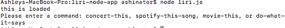

# liri-node-app
LIRI will be a command line node app that takes in parameters and gives you back data.
LIRI must be ran in a command line.
LIRI will accept 4 differnet commands, outlined below.

**For a list of commands, type:**

